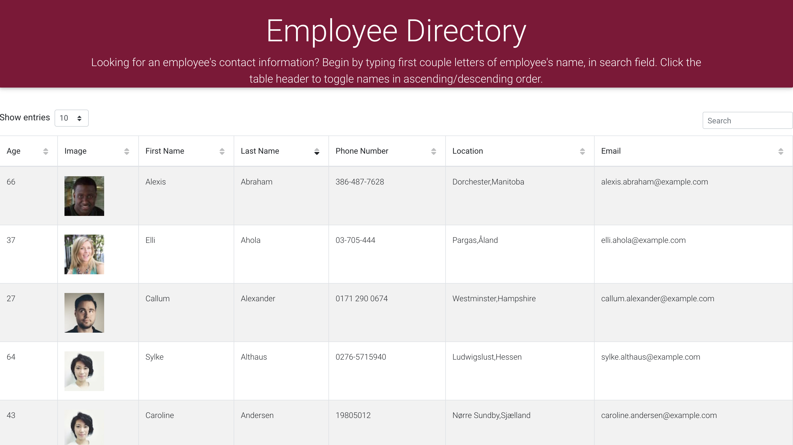

# employee_directory [](https://opensource.org/licenses/MIT)

## Description
 This app is an employee directory created with React, which utilizes an API to populate random users. Users can search for employees by "name" and also organize each field (Name, Email, Age) in ascending or descending order

## Table of Contents

- [Installation](#installation)
- [Technology Usage](#technology-usage)
- [License](#license)
- [Contributions](#contributions)
- [User Story](#userstory)
- [Tests](#tests)
- [Links](#links)
- [Questions](#questions)

### Installation
```
run 'npm install'
Run 'npm start' in order to run app
```

### Technology Usage
- React
- Random User API 
- Javascript
- HTML 
- Bootstrap
- MDB React


### License

This project is licensed under an MIT license.

## Contributions
N/A

## User Story
```
As a user, I want to be able to view my entire employee directory at once so that I have quick access to their information.
```

## Tests

N/A

```
npm start
go to browser and enter localhost:3000
```
## Links
**[Deployed Link]()**




## Questions

- If you have any questions regarding this repository, contact me either by email at **eekwofia@gmail.com**, or you can find more of my work within my github account attached below: 
**[itz-essie](https://github.com/itz-essie)**.
